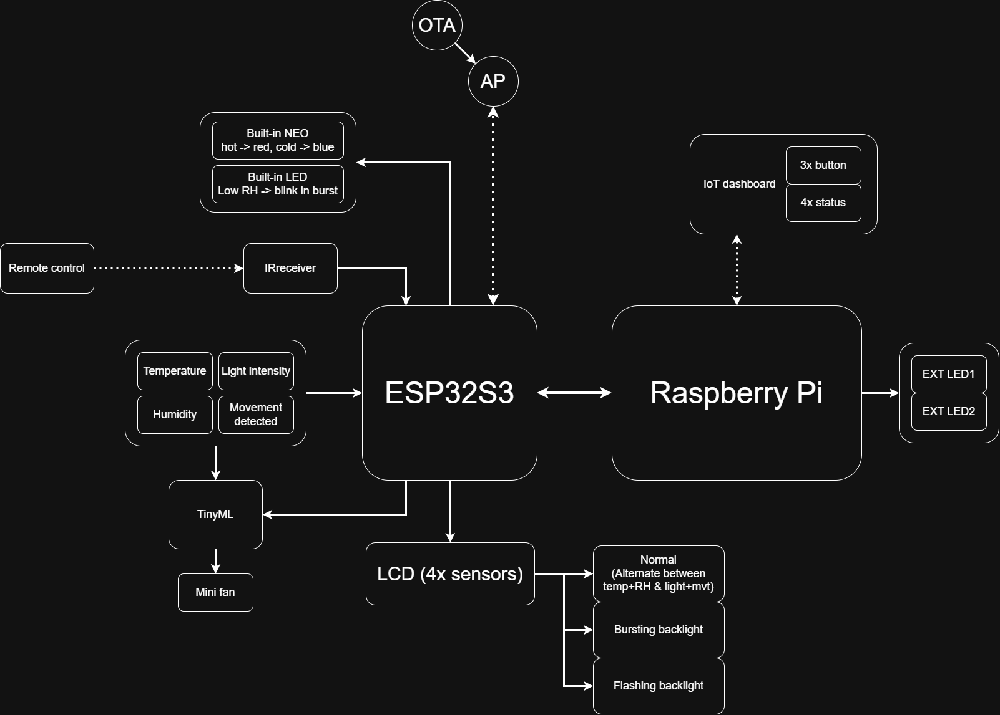

# Smart IoT Office Environment Monitoring System

### Course Information
**Course:** Embedded System  
**Professor:** ThS. Lê Trọng Nhân  
**Team Members:** Đức An — Yến Lê — Tiến Dũng  

---

## 📖 Project Overview
This project implements a **Smart IoT System** designed to monitor the working environment inside an office using **RTOS (Real-Time Operating System)** concepts on the **ESP32-S3** platform.

The system continuously measures environmental factors and applies **TinyML** inference to control actuators intelligently. Remote dashboard and wireless utilities improve system interaction and maintenance.

> This project extends the original *YoloUNO_PlatformIO – RTOS_Project* with more than **30% new functional logic**, compliant with midterm requirements.

---

## System Architecture
The full system block diagram is shown below:

### ✅ Key Features

| Category | Functionality |
|---------|---------------|
| Environmental Sensing | Temperature, Humidity, Light Intensity, Motion Detection |
| AI-Based Control | TinyML model for automated fan activation |
| Interactive Display | LCD cycles sensor groups, alert backlight |
| Status Indication | RGB LED temp indicator, humidity LED alerts |
| Wireless Control | IR remote trigger and manual override |
| IoT Connectivity | Access Point Web Dashboard |
| System Management | OTA firmware update, SSH access via Raspberry Pi |
| External Outputs | Control of 2 external LEDs |

---

## ⚙️ Hardware Components

| Component | Description |
|----------|-------------|
| MCU | **ESP32-S3** development board |
| Host Device | Raspberry Pi (dashboard & SSH bridge) |
| Sensors | Temp & Humidity, Light Level, PIR Motion |
| Actuators | Mini fan, 4× LEDs, LCD 16×2 |
| Communication | WiFi AP, IRremote |
| Indicators | Built-in LED + NeoPixel RGB |

> All software development is performed on **PlatformIO**.

---

## Implemented RTOS Tasks

### Task 1: Temperature-dependent LED Control
• Three behavior states mapped to temperature ranges  
• Semaphore-driven state switching

### Task 2: Humidity-based NeoPixel Color Display
• Three humidity level color thresholds  
• Semaphore synchronization

### Task 3: LCD Monitoring Display
• Three display modes (Normal, Alert, Critical)  
• Flashing and bursting backlight  
• Real-time display updates using semaphores

### Task 4: Web Server in Access Point Mode
• IoT dashboard hosted locally  
• Two interactable device buttons (EXT LED1, EXT LED2)  
• Status visibility on UI

### Task 5: TinyML Inference
• Motion-based ventilation decision logic  
• Real hardware accuracy test included in documentation

---

## Wireless Interaction

| Feature | Purpose |
|---------|---------|
| **OTA** Firmware Update | Remote reprogramming |
| **SSH** via Raspberry Pi | Debug and low-level control |
| **IR Remote** | Emergency override mode |

---

## System Behavior Summary

| Condition | System Reaction |
|----------|----------------|
| High or low temperature | NeoPixel changes color |
| Low humidity | Built-in LED bursts repeatedly |
| Movement detected | TinyML evaluates and fan is triggered |
| IoT button press | External LEDs toggle |
| Warning state | LCD backlight flashing |

